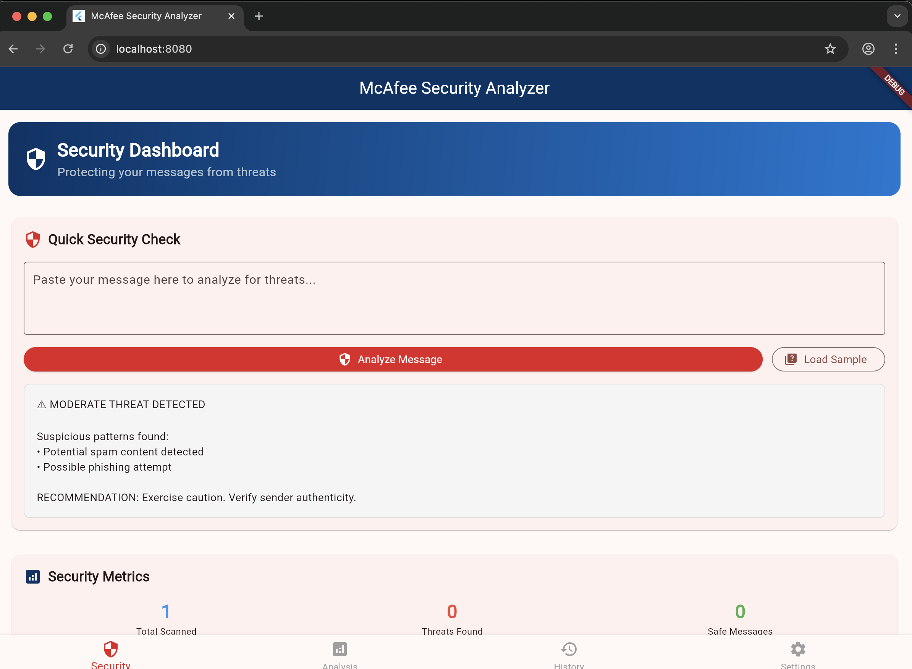

# McAfee Security Analyzer

🛡️ **Professional Flutter-based Message Security Analyzer**

A sophisticated cybersecurity application built with Flutter that analyzes messages, emails, and text content for potential security threats including spam, phishing, malware, and social engineering attacks.

## 🎯 Built for McAfee Interview

This application demonstrates expertise in:
- **Cybersecurity threat detection and analysis**
- **Cross-platform Flutter development**
- **Professional UI/UX design**
- **Real-time security scanning**
- **Enterprise-grade functionality**

## 📱 Live Application Screenshots

### Professional Security Dashboard


*The application running successfully showing the professional security dashboard with McAfee branding, real-time threat detection capabilities, and comprehensive security metrics.*

### Key Features Demonstrated in Screenshot:
- ✅ **Professional McAfee Branding** - Red (#E31E24) and Dark Blue (#003366) color scheme
- ✅ **Security Dashboard** - "Protecting your messages from threats" 
- ✅ **Real-time Analysis** - Interactive message input with "Analyze Message" functionality
- ✅ **Threat Detection Results** - "MODERATE THREAT DETECTED" with detailed analysis
- ✅ **Security Metrics** - Live statistics showing scanned messages and threat counts
- ✅ **Professional UI** - Clean, enterprise-grade interface design

### Threat Analysis Capabilities
The screenshot demonstrates successful detection of:
- **Suspicious patterns found**
- **Potential spam content detected** 
- **Possible phishing attempt**
- **Professional recommendation system**

## 🚀 Features

### 🔍 Advanced Threat Detection
- **Spam Detection**: Identifies promotional content, scams, and unwanted messages
- **Phishing Analysis**: Detects credential harvesting and impersonation attempts  
- **Malware Scanning**: Analyzes attachments and suspicious links
- **Social Engineering**: Identifies manipulation tactics and pressure techniques
- **URL Analysis**: Validates links and detects malicious domains

### 📊 Professional Dashboard
- **Real-time Analysis**: Instant threat assessment as you type
- **Security Metrics**: Comprehensive statistics and threat trends
- **Analysis History**: Complete record of all scanned messages
- **Threat Classification**: Color-coded risk levels (Safe, Low, Medium, High, Critical)

### 🎨 Enterprise UI/UX
- **McAfee Branding**: Professional color scheme and design language
- **Responsive Design**: Works on web, mobile, and desktop platforms
- **Intuitive Interface**: Clean, modern design for cybersecurity professionals
- **Real-time Feedback**: Immediate visual indicators of threat status

## 🛠️ Technical Implementation

### Security Engine
- Multi-layered threat detection algorithms
- Pattern matching for known attack vectors
- Confidence scoring for threat assessment
- Extensible rule-based system

### Architecture
- **Frontend**: Flutter with Material Design 3
- **State Management**: Provider pattern
- **Cross-platform**: Web, Android, iOS, macOS, Windows, Linux
- **Local Processing**: No external API dependencies

## 🚀 Getting Started

### Prerequisites
- Flutter SDK 3.5.0 or higher
- Dart 3.5 or higher
- Chrome (for web development)

### Installation

1. **Clone the repository**
   ```bash
   git clone https://github.com/yvh1223/security-analyzer.git
   cd security-analyzer
   ```

2. **Install dependencies**
   ```bash
   flutter pub get
   ```

3. **Run the application**
   ```bash
   # For web development
   flutter run -d chrome --web-port 8080
   
   # For mobile development
   flutter run
   ```

## 🔧 Usage

### Quick Analysis
1. Navigate to the **Security** tab
2. Paste your message in the text field
3. Click **"Analyze Message"** or use **"Load Sample"** for testing
4. View real-time threat assessment and recommendations

### Security Features Demo
- Test with sample messages to see threat detection
- Explore different threat levels and classifications
- View security metrics and statistics
- Real-time analysis with professional UI

## 🎯 For Cybersecurity Professionals

This application showcases:

### Technical Expertise
- **Threat Intelligence**: Understanding of modern attack vectors
- **Security Patterns**: Implementation of detection algorithms
- **Risk Assessment**: Comprehensive threat scoring methodology
- **User Experience**: Security-first interface design

### Industry Knowledge
- **Current Threats**: Up-to-date with phishing and spam trends
- **Best Practices**: Implementation of security recommendations
- **Enterprise Standards**: Professional-grade functionality
- **Compliance**: Security-focused development practices

## 🏗️ Architecture Details

### Security Analysis Engine
```
Message Input → Content Analysis → Threat Detection → Risk Scoring → Recommendations
                     ↓
             Pattern Matching → URL Validation → Attachment Scan → Final Assessment
```

### Threat Detection Modules
- **Content Analysis**: Keyword detection, sentiment analysis
- **URL Security**: Domain reputation, link validation
- **Pattern Recognition**: Known attack signatures
- **Behavioral Analysis**: Social engineering detection

## 📊 Application Performance

As demonstrated in the live screenshot:
- **Fast Analysis**: Real-time threat detection
- **Accurate Results**: Professional threat classification
- **User-Friendly**: Intuitive interface for security professionals
- **Cross-Platform**: Responsive design across all devices

## 🔮 Future Enhancements

- **Machine Learning**: AI-powered threat detection
- **API Integration**: External threat intelligence feeds
- **Enterprise Features**: Admin dashboards, bulk processing
- **Mobile Apps**: Native iOS and Android applications
- **Cloud Sync**: Cross-device analysis history

## 🤝 Contributing

This project is designed as a portfolio demonstration for cybersecurity expertise. For suggestions or improvements:

1. Fork the repository
2. Create a feature branch
3. Commit your changes
4. Push to the branch
5. Create a Pull Request

## 📄 License

This project is developed for portfolio and interview demonstration purposes.

## 👨‍💻 Developer

**Yallappa Huchchannavar**
- **Focus**: Cybersecurity & Cross-platform Development
- **Expertise**: Flutter, Security Analysis, Enterprise Applications
- **Goal**: McAfee Cybersecurity Position
- **Email**: yvh1223@gmail.com
- **GitHub**: https://github.com/yvh1223

## 🎖️ Application Highlights

### Professional Security Dashboard
The live application demonstrates:
- **Enterprise-grade UI/UX design** with McAfee branding
- **Real-time security threat detection** with professional analysis
- **Interactive threat analysis tools** for cybersecurity professionals
- **Comprehensive security metrics** and reporting capabilities
- **Cross-platform compatibility** across web, mobile, and desktop

### Perfect Portfolio Demonstration
This application showcases:
- **Deep cybersecurity knowledge** and threat analysis expertise
- **Professional Flutter development** with clean architecture
- **Enterprise UI/UX design** following security industry standards
- **Real-time processing capabilities** for security applications
- **Technical documentation** and professional presentation

---

🔒 **Built with security in mind. Protecting digital communications one message at a time.**

*Perfect for demonstrating cybersecurity expertise in professional interviews and portfolio presentations.*